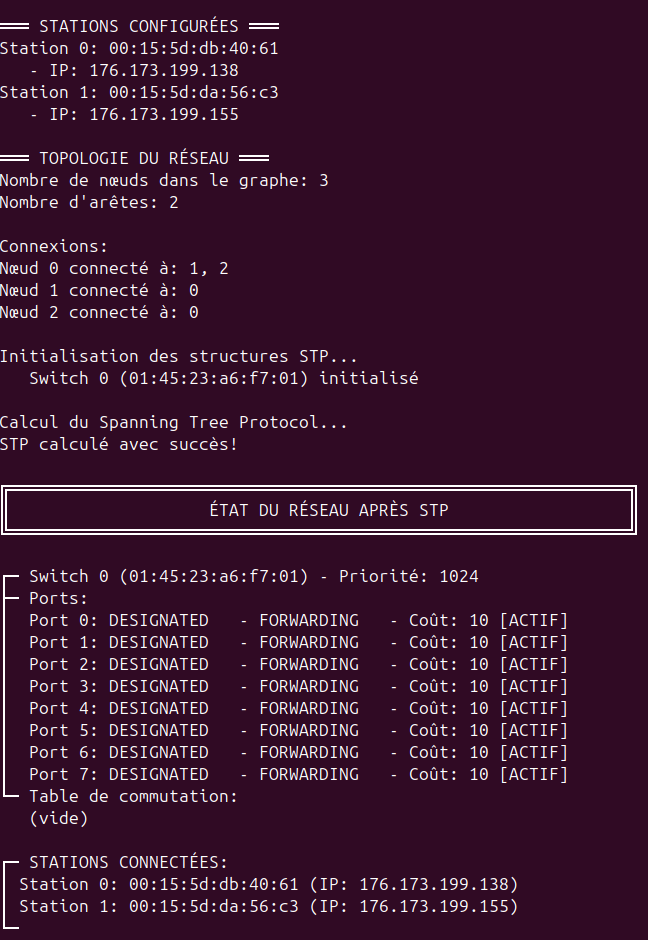
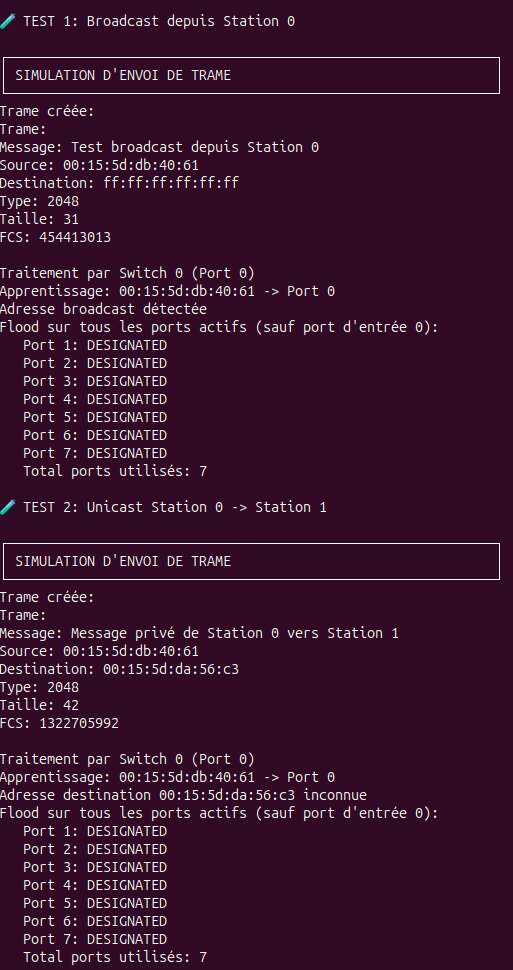

# Simulation Réseau - SAE 2.3 🌐  
[English version below](#english-version)

Simulation Réseau est un projet de simulation d'architecture de réseau local développé en langage C. Le projet implémente les protocoles Ethernet et Spanning Tree Protocol (STP) pour modéliser le fonctionnement d'un réseau local avec stations et switches.

---

## 👥 Contributeurs
| Nom | GitHub |
|-----|--------|
| Arthur ALEXANDRE | [@ArthurALEXANDRE-29](https://github.com/ArthurALEXANDRE-29) |
| Andy PHAN | [@cestlelheure](https://github.com/cestlelheure) |
| Adrien THIERRY |

---

## 🖼️ Aperçu

| État du réseau après STP | Simulation d'envoi de trame |
|--------------------------|----------------------------|
|  |  |


---

## ✨ Fonctionnalités (résumé)
- Structures de données pour modéliser un réseau : adresses MAC, IPv4, stations, switches.
- Réseau représenté comme un graphe étiqueté (librairie M23).
- Chargement d'architectures depuis des fichiers de configuration standardisés.
- Support des poids de liens correspondant aux débits (10Mb/s, 100Mb/s, 1Gb/s).
- Trame Ethernet fidèle au format (préambule, SFD, adresses, type, données, FCS).
- Simulation de commutation : apprentissage MAC, flooding, forwarding.
- Implémentation du Spanning Tree Protocol (BPDU, élection du root, rôles de ports, blocage).
- Affichage console en clair et en hexadécimal, journalisation et scénarios de test.
- Exemples de topologies pour valider la commutation et la convergence STP.

---

## 🚀 Installation & Lancement (Version Simplifiée)

1. Cloner le dépôt  
   ```bash
   git clone https://github.com/ArthurALEXANDRE-29/simulation-reseau.git
   cd simulation-reseau
   ```

2. Prérequis  
   - GCC (ou compilateur C compatible)  
   - make (GNU Make)  
   - Librairie de graphes M23 (si nécessaire : ajouter headers/libs et ajuster le Makefile)

3. Compilation
   ```bash
   make
   ```

4. Nettoyage
   ```bash
   make clean
   ```

5. Exécution (exemple)
   ```bash
   ./simulation exemple_reseau.txt
   ```

Remarques :
- Si la librairie M23 n'est pas installée globalement, modifie le Makefile pour indiquer les chemins de `INCLUDE` et `LIB`.
- Le binaire `simulation` attend en argument le fichier de configuration décrivant équipements et liens.

---

## 🧾 Format des fichiers de configuration (exemple)

```
4 3
2;01:45:23:a6:f7:ab;8;1024
1;54:d6:a6:82:c5:23;130.79.80.21
1;c8:69:72:5e:43:af;130.79.80.27
1;77:ac:d6:82:12:23;130.79.80.42
0;1;4
0;2;19
0;3;4
```

Interprétation :
- Ligne 1 : <nombre_equipements> <nombre_liens>  
- Équipements :
  - Switch : `2;<MAC>;<nb_ports>;<priorite>`
  - Station : `1;<MAC>;<IP>`
- Liens : `<equipement1>;<equipement2>;<poids>`

Poids (convention du projet) :
- 10 Mb/s  → poids = 100  
- 100 Mb/s → poids = 19  
- 1 Gb/s   → poids = 4

Les indices d'équipements utilisés dans la section "liens" suivent l'ordre des équipements listés dans le fichier.

---

## 📁 Structure
```
.
├── README.md
├── Makefile
├── src/
│   ├── main.c
│   ├── station.c
│   ├── station.h
│   ├── switch.c
│   ├── switch.h
│   ├── ethernet.c
│   ├── ethernet.h
│   ├── stp.c
│   ├── stp.h
│   └── ...
├── exemple_reseau.txt
├── assets/
│   ├── Apres-stp.png
│   └── Envoi_tram.png
└── .gitignore
```

---

## 📋 Cahier des charges (avancement)
| Élément | Statut |
|---------|--------|
| Structures (MAC, IP, stations, switches) | ✔️ |
| Chargement fichiers de configuration | ✔️ |
| Simulation trames Ethernet | ✔️ |
| Table de commutation (forwarding) | ✔️ |
| Implémentation STP (BPDU, élection, rôles ports) | ✔️ |
| Convergence & tests sur topologies diverses | ✔️ |
| Makefile & scripts | ✔️ |
| Documentation & exemples | ✔️ |

---

## 📝 Licence
Projet académique réalisé à l'Université de Strasbourg — usage pédagogique.

---

# English Version

## Overview
Simulation Réseau is a local network architecture simulator written in C. The project implements Ethernet frames and the Spanning Tree Protocol (STP) to model a LAN composed of stations and switches, to study frame flooding, switching, and STP convergence.

---

## 👥 Contributors
| Name | GitHub |
|------|--------|
| Arthur ALEXANDRE | [@ArthurALEXANDRE-29](https://github.com/ArthurALEXANDRE-29) |
| Andy PHAN | [@cestlelheure](https://github.com/cestlelheure) |
| Adrien THIERRY |

---

## 🖼️ Screenshots

| STP state | Frame simulation |
|-----------|------------------|
|  |  |

---

## ✨ Features (summary)
- Data structures for MAC and IPv4 addresses, stations and switches.
- Network represented as a labeled graph (M23 library).
- Load network topology from standardized configuration files.
- Link weights mapping to speeds (10Mb/s, 100Mb/s, 1Gb/s).
- Accurate Ethernet frame structure and hex/user display.
- Switching simulation with MAC learning, flooding and forwarding.
- Full STP implementation (BPDU exchange, root election, port roles, blocking).
- Console output and logs, test scenarios included.

---

## 🚀 Quick Setup

1. Clone repository
   ```bash
   git clone https://github.com/ArthurALEXANDRE-29/simulation-reseau.git
   cd simulation-reseau
   ```

2. Requirements
   - GCC (or compatible C compiler)
   - make
   - M23 labeled graph library (place headers/libs locally or system-wide)

3. Build & run
   ```bash
   make
   ./simulation exemple_reseau.txt
   ```

---

## 📁 Project layout
See structure above.

---

## 📋 Progress
| Item | Status |
|------|--------|
| Data structures | ✔️ |
| Config file loader | ✔️ |
| Ethernet frame simulation | ✔️ |
| Forwarding / MAC table | ✔️ |
| STP (BPDU, election, port roles) | ✔️ |
| Convergence tests | ✔️ |
| Makefile & scripts | ✔️ |
| Docs & examples | ✔️ |

---

## 📝 License
Academic project — University of Strasbourg (educational use).

---
